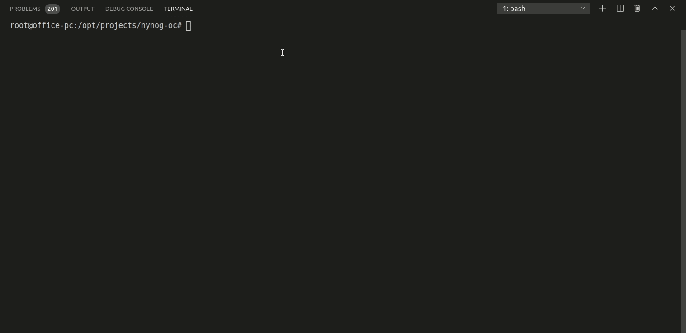
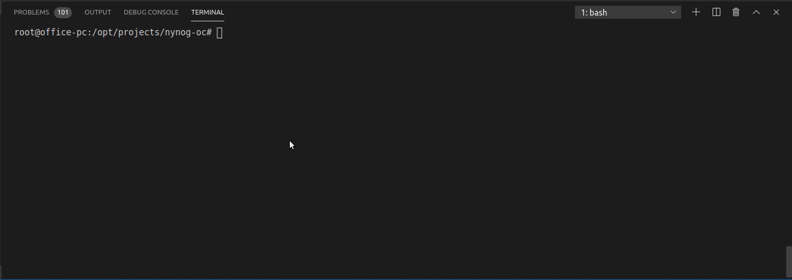
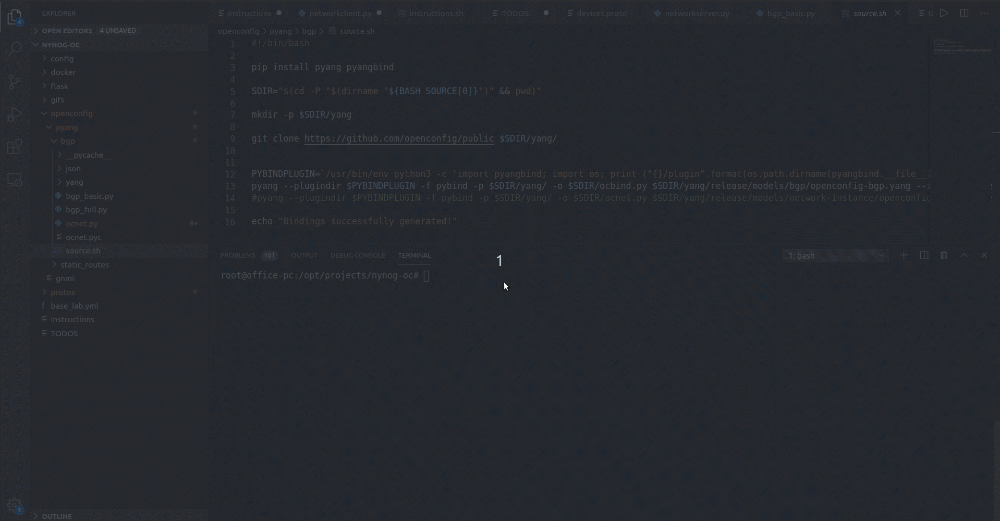
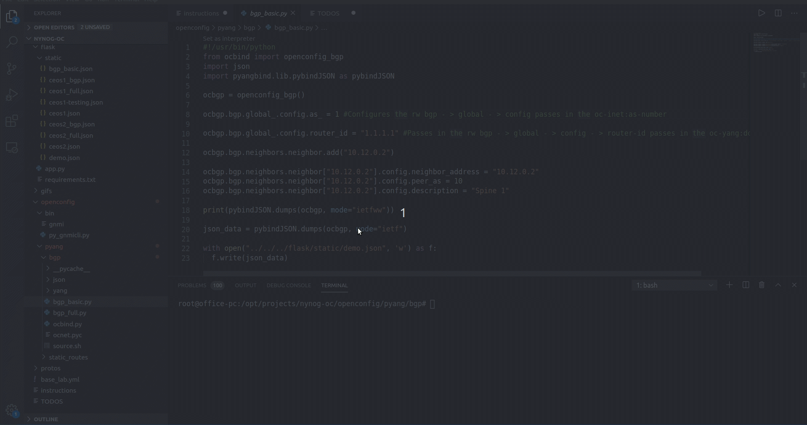

# Description
This is a repo for a openconfig discussion given at NYNOG to explain the overall process of how openconfig works.

## Requirements
[Docker-topo](https://github.com/networkop/docker-topo)
Arista cEOS version 4.23.2F named ceosimage:4.23.2F

## Demo lab infrastructure

### Pull and run the docker from the root directory.
docker pull burnyd/flask-api:latest
docker run --name nynog-flask-api -dit $PWD/flask/static:/nynog-oc/flask/static -p 5000:5000 burnyd/flask-api:latest

### Run docker-topo to bring up the lab.
docker-topo --create base-lab.yml from the root directory.

### Use pyangbind and create python classes for BGP openconfig.
#### This will take some time.
cd openconfig/pyang/bgp
source source.sh

### Take a look at the yang tree for bgp neighbors.
pyang -f tree -p yang/ yang/release/models/bgp/openconfig-bgp.yang  | less

### Create the data structure for BGP neighbors
python3 bgp bgp_basic.py

### Apply bgp config through the gNMI interface
#### Move into the bin directory.

#### Get the BGP config through gNMI get request.

gnmi -addr 127.0.0.1:7001 -username arista -password arista get '/network-instances/network-instance[name=default]/protocols/protocol[name=BGP][identifier=BGP]/bgp'
gnmi -addr 127.0.0.1:7001 -username arista -password arista get '/network-instances/network-instance[name=default]/protocols/protocol[name=BGP][identifier=BGP]/bgp'

#### Apply the config through the gNMI set service.

gnmi -addr 127.0.0.1:7000 -username arista -password arista replace '/network-instances/network-instance[name=default]/protocols/protocol[name=BGP][identifier=BGP]/bgp' ../../flask/static/ceos1_bgp.json
gnmi -addr 127.0.0.1:7001 -username arista -password arista replace '/network-instances/network-instance[name=default]/protocols/protocol[name=BGP][identifier=BGP]/bgp' ../../flask/static/ceos2_bgp.json

